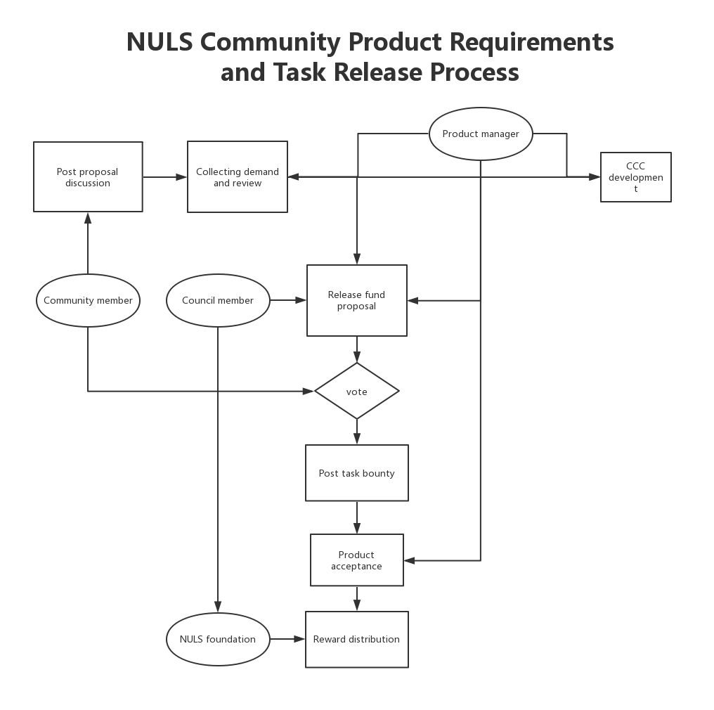

```
  NIP: 7
  Title: NULS Community Product Demand and Task Release Process
  Author: Reaper Ran <reaper@nuls.io> 
  Discussions-To: https://nuls.community/d/462
  Status: Last call
  Type: Process
  Created: 2019-3-21
```

## Preface

NULS is an open source community project. And innovation is the driving force behind the development of open source community projects. The community is both a carrier for the NULS project and a user of the NULS project. Then the product demand must come from the market and users, so I hope to write a process for community product demand collection.


## Abstract

The NULS Community Product Demand and Task Release process demonstrates how a community member can initiate a demand, as well as a process from reporting and evaluating the demand to technology development. 


## Motivation

In order to give full play to the initiative of the community, and stimulate the participation of community members to provide the products that are creative for NULS development and have great significance for the value enhancement and ecological development of NULS. The product manager then evaluates the demands of the community and then add them to the community development. 


## Specification



I.The product demand proposal

1. Initiate a product demand proposal on the community website nuls.community;

2. The proposal needs to describe the demand in details as much as possible;

3. The proposor organize the community to participate in open discussions, collect suggestions, and improve the proposal;

4. Post the demand to the Issues section of the NULS Github related section.


II.Collecting and reviewing demand

1. Product manager conduct research and analysis on product demand proposals;

2. The NULS core team and the  NULS councils review whether it enter the development.


III. The allocation of technology development

1.Assigned to NULS CCC members

* Sort out product demands and assign product demands to NULS CCC members for development;

* Product manager follow up acceptance and release of product.

2.Assigned to non-CCC members— Task release reward

* Product manager evaluate product demands and determine a task reward standard;
* The product manager forwards the proposal to the council member to initiate the fund proposal in accordance with the original product proposal;
* The Product manager publish the product task on the reward task page;
* The developer applies for the task, and the product manager updates the task status to be in progress;
* The developer completes and submits;
* After the Product manager finish product acceptance, the task status is updated to completion;
* The members of the council submit the fee payment application to the foundation mailbox.