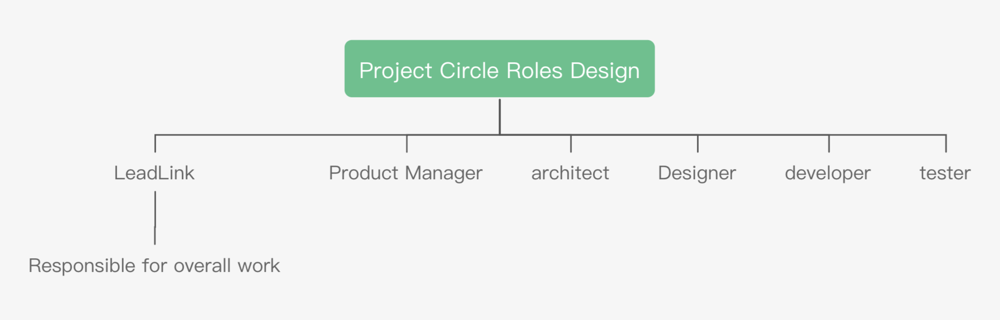

```
 NIP: 9
 Title: NULS Technical Community Charter
 Author: Niels <niels@nuls.io>
 Discussion channels: https://nuls.community/d/588-nuls
 Status: Draft
 Type: Process
 Creation date: 2019/07/30
```

##  Preamble

With the development and growth of the NULS technology community, the NULS technology community has absorbed more and more developers from all over the world. In order to enable developers to collaborate efficiently and receive rewards based on actual efforts, we hope to establish A well-functioning mechanism and a flexible and friendly community charter to govern the technical community of NULS


## Summary

This community is centered on the underlying R&D and maintenance team, including application developers, tool developers, and outsourced service providers. It is responsible for solving all technical problems such as NULS network maintenance, application development, and tool iteration.

## Motivation

The former CODE CRAFT COUNCIL is a loose and open open organizational structure with no managers and no assessment mechanism. After members join, they can only contribute according to their own conscious, and the results are very limited, but each member can get a stable payment, which is unfair. The goal of our reform is to improve the efficiency, fairness and combat effectiveness of NTC.

## Specification

### Holacracy

We can try to divide the NTC into two levels. The top management will temporarily slow down the progress, and run in the traditional community council mode. At the bottom of each sub-circle, try to try the standard system until everyone Very familiar with the system, then carry out the reform of NULSCracy.

### NTC's organizational structure

For the normal development of NTC, different organizations should be set up at different stages. Combined with the current development status of CCC, a new organizational structure is designed and assembled, as follows:


#### Root Circle--NTC
Everyone belongs to NTC, and all circles belong to the sub-circle of NTC. The management of NTC is handled by the NTC Council. The way to start work is to establish specific circles for specific businesses. Each circle is the experience accumulated by NTC practice holacracy. When it is accumulated to a certain extent, it will carry out the reform of NULSCracy.
#### NTC Council(NTCC)
The NULS Technical Community Council is composed of singular members and is expected to have 5 to 9 members. NTCC is responsible for the results of the entire NULS technical community.
##### NTCC's responsibilities
* Discuss and decide on major NTC issues
* Manage NTC members
* Listen to and review reports from sub-circles to resolve difficulties encountered by sub-circles
* Modify NTC organizational structure
* Decide on the technical direction of NULS and continue to innovate
* Enhance NTC technology strength
##### NTCC member composition
The initial members of the NTCC are composed of technical directors of the NULS Community Council. The NULS Community Technology Director is the core technical staff selected by all the holders of the currency, a total of four. Responsible for technical work in the community council and communication and information synchronization between the community and the technical community. Among the four community directors, the chief director of the rotation is set up. The responsibility is to report to the community the results of this week's NTC work, the next week's plan and the problems encountered. The chief director of the rotation shall be appointed for a term of three months. After the expiration, the rotation shall be in the order of the next technical director.
After the election of the technical director results, the number of NTCC members needs to be increased. According to the total number of NTCs, one and three members are required, and five NTC members are added to the NTCC. The joining method is appointed by the technical director. The system does not interfere with how the technical directors agree, but as long as the NTCC members are insufficient, the NTCC award will not be issued.
To become an NTCC member, you need to have basic requirements. Not all NTC members can become NTCC members. The specific requirements are as follows:
* full time
* Working in NTC (including coreteam) for more than 3 months.
##### NTCC Rights
Make decisions on all matters within NTC, including but not limited to:
* NTC member management: joining the review, rating, remuneration, dismissal members
* Determine the technical direction and technical details of NULS
* Project progress tracking, assessment and risk management
* Performance appraisal
* Management of reward tasks: initiation, tracking, conducting, payment, acceptance, etc.
* Other technical community affairs
##### NTCC can't decide things
Any changes related to the changes described in the white paper must be voted in the community and NTCC has no right to change.
##### NTCC role settings
  
* Secretary: The organization responsible for the meeting, the synchronization of the hosting, recording and information
* Treasurer: Responsible for the calculation of member compensation, node creation and delegation.

##### NTCC rewards
Because the role of NTCC is not the primary role of a member, each role is concurrent with the other roles of other circles, so the reward is distributed in the same way as the reward of the main character.
Taking into account the particularity of the NTCC, the NTCC members are not graded and only symbolic rewards are made:
|Role|Foundation|Extra Awards|Description|
| ------ | ------ | ------ | ------ |
|secretary|1000 NULS/Month|200NULS/Month|Basic rewards are not superimposed with technical director rewards|
|Finance staff|1000 NULS/Month|200NULS/Month|Basic rewards are not superimposed with technical director rewards|
|Member|1000 NULS/Month|0|Basic rewards are not superimposed with technical directors rewards|

#### NTC Convention
1. The UTC holds a regular meeting at 10:00 UTC every Thursday. The meeting is presided over by the secretary. After the meeting, the meeting minutes are sent to relevant personnel, and relevant personnel can forward the meeting minutes as appropriate. The three meetings before each month are the NTCC regular meeting and the fourth meeting is the NTC general meeting. The meeting was conducted using the tool Zoom. The sub-circle weekly meeting mechanism can be adjusted according to the specific situation, but it is recommended that each sub-circle conduct a weekly meeting before the NTCC meeting.
Zhou Hui attendance: When a member is absent for two consecutive weeks, but there is no early leave, a warning is given to cancel the qualification for the quarterly application. The member was removed from the NTC after being left unwarranted after the warning.
2. Each NTCC member can convene an ad hoc meeting to deal with critical events in a timely manner.
3. Actively participate in the discussion of various proposals, express their opinions cautiously and clearly, and be responsible for their opinions.
4. The Technical Director reports weekly to the NULS Council on the work of the NTC. The rotating chief technical officer is responsible for checking the weekly reports of all members and urging members who have not submitted weekly reports. Summarize all weekly content for risk control
5. The ITC publishes an NTC work report to the community every half month (the current work, the next plan)
6. Leadlink in any sub-circle can communicate with any NTCC member, feedback questions, make suggestions, seek decisions, etc.
8. The NTCC unifies the division of labor for each member, with a focus on the comments of the sub-circle Leadlink.
9. When a member of the NTCC quits, promptly add new members to the NTCC.
10. The NTCC is a community and the Board can evaluate and punish NTCC results.
11. Guide working hours
* full time
80 hours/2weeks
* part time
40 hours/2weeks
Each member reports their working hours and output results in the weekly report. The other members of the project are working with the NTCC to assess whether the output is normal. If the results are insufficient, they can be submitted to the NTCC for punishment. The means of punishment can be Warning, downgrade, leave NTC three.
12. Each member is required to submit a weekly report that fully describes his work time, work content, and work results this week. The weekly report is written in Markdown format. After writing, the content is uploaded to github, which is inspected and supervised by the rotating chief technical officer (other members can also be assigned)
The weekly report must be submitted. If a member has not submitted a weekly report for two weeks, the reward will be discontinued until the member completes the weekly report and explains the reason. If the member does not send a weekly report for one month, the member is removed from the NTC.
13. Member level change
After the implementation of this program has been implemented, everyone can apply for a registration assessment to help NTCC members to better assess their grades through working hours and work output.
In principle, each member performs a registration assessment at most once a quarter. (The first time is the registration assessment, the second is the change assessment). When the NTCC takes the initiative to adjust the level to a member, it does not need to occupy the quarterly assessment indicator.
14. NTC member holidays
If the members have insufficient working hours, they can apply for replenishment in the next cycle. After the approval of the board of directors, the payment will not be affected.
For their own reasons, members need to stop working for a certain period of time. After the approval of the board of directors, they can conduct a “lost payoff”. If the board does not agree, it is considered to leave the NTC.
A paid holiday of 15 working days a year, the holiday time can be freely controlled.
15. Members join
All applicants are welcome to apply for the application, specific application materials: resume, why to join NTC, and plans to join NTC.
Joined NTC after being approved by the NTCC.
16. Member probation period
New members have a three-month probationary period after joining NTC. They have no remuneration for the first month, 80% for the second and third months, and 100% for the probationary period.
17. Member exit
* Proactive withdrawal: application, handover, settlement payment
* Dismissal: notify the whole community, settlement payment
18. Remuneration
* All members use NULS as the payment settlement method
* In principle, each member needs to provide the server itself, maintain a NULS node, and set the node's reward address to the financially specified address.
* It is financially responsible to adjust each member's node settings and fund delegation in a timely manner. The specific amount of compensation is calculated according to role and level.
* The remuneration of outsourced personnel needs to be paid in segments. The specific payment amount and time are determined by the docker and NTCC.
* What else to do in the future:

    1. Performance appraisal mechanism, the results of the assessment and the rewards are linked.

    2. Remuneration management contract: At present, the core team manages the node establishment and commissioning work. In the future, a smart contract will be prepared to collect the income of all addresses in a unified manner, and the amount of each member will be set monthly. Each member will receive remuneration on a regular basis.
#### Member Reward Hierarchical Design
We designed a hierarchical reward model in four cases, which deal with the calculation of NULS's rewards in different price ranges. The following five price ranges: <$1, $1 - $3, $3 - $5, $5 - $10,> $10. The specific settings are as follows:
##### NULS price is less than 1 dollar

At this time, the full-time minimum wage is about 1030 NULS, and the highest is about 7213 NULS.

| | Full-time | Full-time | Full-time | Full-time | Part-time | Part-time | Part-time | Part-time |
| ---- | ------ | -------- | ------ | ----------------- | ------ | -------- | ------ | ------------- |
| level | deposit | commission  | stake | specification | deposit | commission | stake |specification|
| level 1 | 2w | 40 | 20w | 10w staking reward | 2w | 15 | 20w | 5w staking reward |
| level 2 | 2w | 90 | 20w | 20w staking reward | 2w | 40 | 20w | 10w commission staking reward |
| level 3 | 2w | 100 | 28w | 30w staking reward | 2w | 65 | 20w | 15w staking reward |
| level 4 | 2w | 100 | 33w | 35w gain | 2w | 78 | 20w | 17.6w gain |
|level 5 | 2w | 100 | 38w | 40w staking reward | 2w | 90 | 20w | 20w staking reward |
| level 6 | 2w | 100 | 43w | 45w staking reward | 2w | 100 | 20.5w | 22.5w staking reward |
|level 7 | 2w | 100 | 48w | 50w staking reward | 2w | 100 | 23w | 25w staking reward |
| level 8 | 5w | 100 | 50 | 55w staking reward | 2w | 100 | 25.5w | 27.5w staking reward |
| level 9 | 10w | 100 | 50w | 60w staking reward | 2w | 100 | 28w | 30w staking reward |
| level 10 | 20w | 100 | 50w | 70w staking reward | 2w | 100 | 33w | 35w staking reward |

##### NULS is between 1 dollar and 3 dollar

At this time, the full-time minimum wage is about 1030 NULS, and the maximum is about 5666 NULS.

| | Full-time | Full-time | Full-time | Full-time | Part-time | Part-time | Part-time | Part-time |
| ---- | ------ | -------- | ------ | ----------------- | ------ | -------- | ------ | ------------- |
| level | deposit | commission| stake  | specification | commission| commission | stake | specification |
| level 1 | 2w | 40 | 20w | 10w staking reward | 2w | 15 | 20w | 5w staking reward |
| level | 2w | 65 | 20w | 15w staking reward | 2w | 28 | 20w |6,000 entrusted staking reward |
| level 3 | 2w | 90 | 20w | 20w staking reward | 2w | 40 | 20w | 10w staking reward |
| level 4 | 2w | 100 | 23w | 25w staking reward | 2w | 53| 20w | 12.6w staking reward |
| level 5 | 2w | 100 | 28w | 30w staking reward | 2w | 65 | 20w | 15w staking reward |
|level 6 | 2w | 100 | 33w | 35w staking reward | 2w | 78 | 20w | 17.6w staking reward |
|level 7 | 2w | 100 | 38w | 40w staking reward | 2w | 90 | 20w | 20w staking reward |
| level 8 | 2w | 100 | 43w | 45w staking reward | 2w | 100 | 20.5w | 22.5w staking reward |
|level 9 | 2w | 100 | 48w | 50w staking reward | 2w | 100 | 23w | 25w staking reward |
| level 10 | 5w | 100 | 50w | 55w staking reward | 2w | 100 | 28w | 30w staking reward |

##### NULS price is higher than 3 dollars
To be determined
### Project Circle Character Design

Each of the above roles can be taken from the basic role of the members, the compensation is calculated according to the project's needs and the basic role, the project leader can make a proposal for the complex rewards, and the NTCC will pass the audit.
Other gameplay can also be applied to the NTCC and implemented after approval.