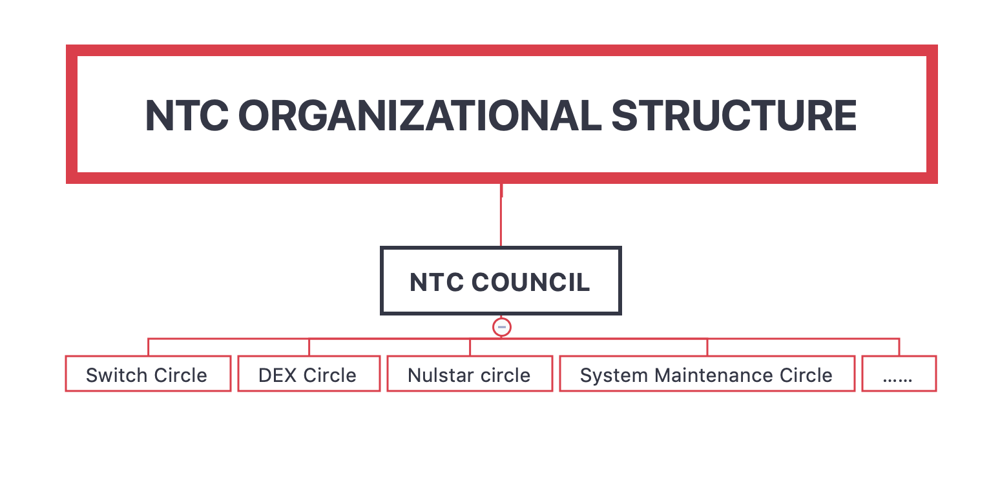
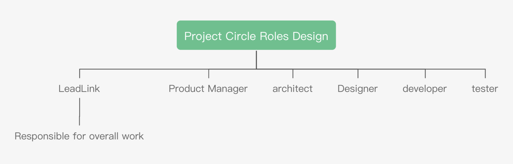

```
 NIP: 9
 标题: NULS技术社区章程
 作者: Niels <niels@nuls.io>
 讨论渠道: 
 状态: 草稿
 类型: 流程
 创建日期: 2019/07/30
```

## 前言

随着NULS技术社区的发展和壮大，NULS技术社区吸纳了越来越多的来自己全球各地的开发者，为了让开发者之间能够高效相互协作并根据实际付出获得相应的奖励，我们希望建立一个可良好运转的机制和一个灵活友好的社区章程，来治理NULS的技术社区


## 摘要

这个社区以底层研发和维护团队为核心，包含应用开发者、工具开发者、外包服务提供者为主体，解决NULS网络维护、应用开发、工具迭代等所有技术问题为责任

## 动机

曾经的CODE CRAFT COUNCIL是一个松散的平等的开放型组织结构，没有管理者，没有考核机制。成员加入之后只能根据自觉来进行贡献， 成果非常有限，但每个成员却可以稳定的获取报酬，这是不公平的。我们改革的目标是提高NTC的效率，公平性和战斗力

## 规范

### 合弄制 holacracy

我们可以尝试将NTC分为两个层级，顶层管理职暂缓合弄制的进度，以传统的社区理事会方式运行，底层的各个子圈子，尽可能的尝试标准的合弄制，直到每个人都很熟悉合弄制之后，再进行NULSCracy的改革。

### NTC的组织结构

为了NTC的正常发展，在不同的阶段应该设置不同的组织机构，结合目前的CCC发展现状，集合合弄制设计了新的组织结构，如下：



#### 根圈子--NTC
所有人都属于NTC，所有圈子都属于NTC的子圈子。NTC的管理事务由NTC Council处理。工作展开的方式是具体业务建立具体的圈子来进行，每个圈子都是NTC实践holacracy的经验积累，当积累到一定程度后，再进行NULSCracy的改革。
#### NTC Council（NTCC）
NULS技术社区理事会由单数成员组成，预计成员数量为5~9名，NTCC需要对整个NULS技术社区的工作结果负责。
##### NTCC的职责
* 讨论和决定NTC重大问题
* 管理NTC成员
* 听取和审查子圈子的报告，解决子圈子遇到的困难
* 修改NTC组织结构
* 决定NULS的技术方向，持续创新
* 增强NTC技术实力
##### NTCC的成员组成
NTCC最初的成员由NULS社区理事会的技术理事组成，NULS社区技术理事是全体持币人选出的核心技术人员，共4名。负责社区理事会中的技术工作及社区和技术社区的沟通、信息同步工作。4名社区理事中，设置轮值首席理事一名，其责任是周会中向社区报告本周NTC工作成果、下周计划和遇到的问题。轮值首席理事任期3个月，期满后按一定顺序轮换为下一个技术理事担任。
技术理事成果票选出后，需要增加NTCC成员数量，根据不同的NTC总人数，分别需要1名、3名，5名NTC成员加入NTCC，加入方式为技术理事任命。制度不干预技术理事们如何达成一致，但只要NTCC的成员不足，就不会发放NTCC的奖励。
成为NTCC成员，需要有基本的要求，并非任何NTC成员都可以成为NTCC成员，具体要求如下：
* 全职
* 在NTC(包括coreteam)中工作时间超过3个月。
##### NTCC的权利
对NTC内部所有事情形成决议，包括但不限于：
* NTC成员管理：加入审核、评级、报酬发放、辞退成员
* 确定NULS的技术方向和技术细节
* 项目的进度跟踪、评估及风险管控
* 绩效考核
* 悬赏任务的管理：发起，跟踪，进行、支付报酬、验收等
* 其他技术社区内事务
##### NTCC不能决定的事情
任何与修改白皮书描述的内容有关的改变，都必须进行社区投票，NTCC没有权利更改。
##### NTCC的角色设置
  
* Secretary：负责会议的组织，主持、记录和信息的同步
* Treasurer：负责成员报酬的计算，节点的创建和委托。
##### NTCC的奖励
因为NTCC的角色不作为成员的主要角色，所以每个角色都是其他圈子的其他角色兼任，所以奖励以叠加的方式和主角色的奖励一同发放。
考虑到NTCC的特殊性，不对NTCC的成员进行级别划分，只进行象征性的奖励：
|角色|基础奖励|额外奖励|说明|
| ------ | ------ | ------ | ------ |
|secretary|1000 NULS/Month|200NULS/Month|基础奖励不与技术理事奖励叠加|
|财务人员|1000 NULS/Month|200NULS/Month|基础奖励不与技术理事奖励叠加|
|委员|1000 NULS/Month|0|基础奖励不与技术理事奖励叠加|

#### NTC公约
1. 每周四 10：00 UTC召开例会，会议由秘书主持，会后发送会议纪要给相关人员，相关人员可以视情况转发会议纪要。每个月前三次会议为NTCC例会，第四次会议为NTC全体大会。会议使用工具Zoom进行。子圈子周会机制可以根据具体情况进行调整，但建议各个子圈子在NTCC会议之前进行周会。
周会出席：当有成员连续两次周会缺席，却没有提前请假的情况，给出警告，取消本季度调级申请资格。当警告后依然无故缺席，则该成员移出NTC。
2. 每一个NTCC成员都可以召集临时会议及时处理紧要事件。
3. 积极参与各种提案的讨论，谨慎并明确的表达自己的意见，并为自己的意见负责。
4. 由技术理事每周向NULS理事会报告NTC工作情况。轮值首席技术理事负责检查所有成员的周报，并督促未提交周报的成员。汇总所有周报内容进行风险控制
5. 由技术理事每半个月向社区公布一个NTC工作情况报告（本期工作内容，下期计划）
6. 任何子圈子的Leadlink都可以和任意一个NTCC成员沟通，反馈问题，提出建议，寻求决策等。
8. 由NTCC统一决策每个成员的分工，重点考虑子圈子Leadlink的意见。
9. 当NTCC中有成员退出时，及时补充新成员进入NTCC。
10. NTCC是共同体，理事会可以对NTCC结果进行评估和惩罚。
11. 指导工作时间
* 全职
80 hours/2weeks
* 兼职
40 hours/2weeks
每个成员在周报中汇报自己的工作时间和产出成果，成员所在项目其他人和NTCC一起来评估产出成果是否正常，如果认为结果不足，可以通过提案提请NTCC进行处罚，处罚的手段可以是警告、降级、离开NTC三种。
12. 每个成员每周都需要提交一个周报，完整的描述自己本周的工作时间，工作内容，工作结果。周报以Markdown的格式编写，编写后将内容上传到github上，由轮值首席技术理事负责检查和督促（也可以指派其他理事会成员进行）
周报必须提交，如果有成员连续两周未提交周报，则停止奖励发放，直到该成员完成周报的提交，并说明原因。如果成员一个月未发周报，则将该成员移出NTC。
13. 成员等级变更
在本方案达成一致开始执行后，每个人都可以申请一次登记评定，通过工作时间和工作产出的阐述，帮助NTCC成员来更好的进行级别评定。
原则上每个成员每个季度最多进行一次登记评定。（第一次为登记评定，第二次后为变更评定），当NTCC主动给一个成员调整级别时，不需要占用季度评定指标。
14. NTC成员假期
成员工作时间不足的情况，可以申请在下一个周期内补足，理事会同意后，不影响报酬的发放。
成员因自身原因，需要在一定时间内停止工作的情况，理事会同意后，可以进行“停薪留角”，若理事会不同意，则视为离开NTC。
一年15个工作日的带薪假期，假期时间可以自由支配。
15. 成员加入
欢迎所有人提出加入申请，具体申请资料：个人简历、为什么加入NTC、加入NTC后的计划。
由NTCC审核通过后加入NTC。
16. 成员试用期
新成员加入NTC后有3个月试用期，第一个月没有报酬，第二个月和第三个月可以领取80%报酬，试用期后可以领取100%报酬。
17. 成员退出
* 主动退出：提出申请，进行交接，结算报酬
* 辞退：通报全社区，结算报酬
18. 报酬发放
* 全体成员以NULS作为报酬结算方式
* 原则上每个成员需要自己提供服务器，维护一个NULS节点，并设置节点的奖励地址为财务指定的地址。
* 由财务负责及时调整每个成员的节点设置和资金委托，具体的报酬数量根据角色和级别计算
* 外包人员的报酬需要分段支付，具体支付数量和时间由对接人和NTCC决定
* 未来还要做什么：
    1. 绩效考核机制，考核结果和报酬挂钩。
    2. 报酬管理合约：目前由核心团队来管理节点建立和委托工作，未来会编写一个智能合约，统一收集所有地址的收益，按月设置每个成员的发放数额，每个成员定期自主领取报酬。
#### 成员奖励分级设计
我们设计了4种情况下的分级奖励模型，分别应对NULS在不同价格区间的报酬计算方式，如下5个价格区间：<$1 , $1 - $3, $3 - $5, $5 - $10,> $10。具体设置如下：
##### NULS价格低于1美元

此时全职最低工资约为1030 NULS,最高约为7213 NULS

|      | 全职   | 全职     | 全职   | 全职              | 兼职   | 兼职     | 兼职   | 兼职          |
| ---- | ------ | -------- | ------ | ----------------- | ------ | -------- | ------ | ------------- |
| 级别 | 保证金 | 佣金比例 | 委托量 | 说明              | 保证金 | 佣金比例 | 委托量 | 说明          |
| 1级  | 2w     | 40       | 20w    | 10w委托的全部收益 | 2w     | 15       | 20w    | 5w委托收益    |
| 2级  | 2w     | 90       | 20w    | 20w收益           | 2w     | 40       | 20w    | 10w委托收益 |
| 3级  | 2w     | 100       | 28w    | 30w收益           | 2w     | 65       | 20w    | 15w收益       |
| 4级  | 2w     | 100      | 33w    | 35w收益           | 2w     | 78       | 20w    | 17.6w收益     |
| 5级  | 2w     | 100      | 38w    | 40w收益           | 2w     | 90       | 20w    | 20w收益       |
| 6级  | 2w     | 100      | 43w    | 45w收益           | 2w     | 100       | 20.5w    | 22.5w收益     |
| 7级  | 2w     | 100      | 48w    | 50w收益        | 2w     | 100       | 23w    | 25w收益       |
| 8级  | 5w     | 100      | 50     | 55w收益           | 2w     | 100      | 25.5w  | 27.5w收益     |
| 9级  | 10w     | 100      | 50w     | 60w收益           | 2w     | 100      | 28w    | 30w收益       |
| 10级 | 20w     | 100      | 50w    | 70w收益           | 2w     | 100      | 33w    | 35w收益       |
#####  NULS价格在1到3美元之间

此时全职最低工资约为1030 NULS,最高约为5666 NULS

|      | 全职   | 全职     | 全职   | 全职              | 兼职   | 兼职     | 兼职   | 兼职          |
| ---- | ------ | -------- | ------ | ----------------- | ------ | -------- | ------ | ------------- |
| 级别 | 保证金 | 佣金比例 | 委托量 | 说明              | 保证金 | 佣金比例 | 委托量 | 说明          |
| 1级  | 2w     | 40       | 20w    | 10w委托的全部收益 | 2w     | 15       | 20w    | 5w委托收益    |
| 2级  | 2w     | 65       | 20w    | 15w收益           | 2w     | 28       | 20w    | 7.6万委托收益 |
| 3级  | 2w     | 90       | 20w    | 20w收益           | 2w     | 40       | 20w    | 10w收益       |
| 4级  | 2w     | 100      | 23w    | 25w收益           | 2w     | 53       | 20w    | 12.6w收益     |
| 5级  | 2w     | 100      | 28w    | 30w收益           | 2w     | 65       | 20w    | 15w收益       |
| 6级  | 2w     | 100      | 33w    | 35w收益           | 2w     | 78       | 20w    | 17.6w收益     |
| 7级  | 2w     | 100      | 38w    | 40w收益           | 2w     | 90       | 20w    | 20w收益       |
| 8级  | 2w     | 100      | 43w     | 45w收益           | 2w     | 100      | 20.5w  | 22.5w收益     |
| 9级  | 2w     | 100      | 48w     | 50w收益           | 2w     | 100      | 23w    | 25w收益       |
| 10级 | 5w     | 100      | 50w    | 55w收益           | 2w     | 100      | 28w    | 30w收益       |
##### NULS价格高于3美元
待定
### 项目圈子角色设计

以上每个角色都可以从基础角色中物色成员担任，报酬根据项目方需求和基础角色综合计算，项目负责人可以对复杂奖励的情况进行提案，NTCC审核通过后实行。
其他玩法也可以向NTCC申请，批准后实行。